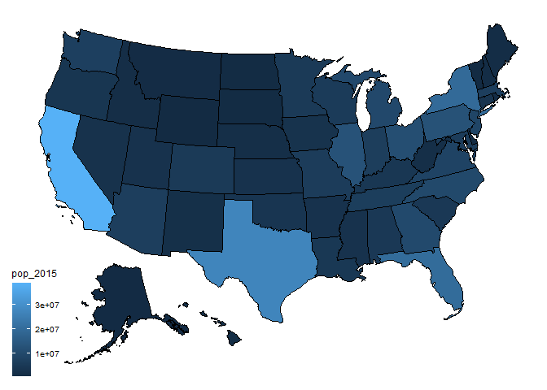

# snippets

Mutate multiple columns, keeping original and appending names to the new
ones.

``` r
library(dplyr)

data.frame(x1 = rnorm(5, mean = 100),
           x2 = rnorm(5, mean = 1000)) |> 
  mutate(across(everything(),
                .fns = list(log = ~log(.)),
                .names = '{fn}_{col}'))
```

             x1        x2   log_x1   log_x2
    1 100.50771 1000.1849 4.610234 6.907940
    2  98.68160 1000.7564 4.591899 6.908511
    3  98.64793  998.1787 4.591557 6.905932
    4  99.35667 1001.3662 4.598716 6.909121
    5 101.30587 1002.5336 4.618144 6.910286

Scraping Excel files embedded in a website. FHWA TVT example.

``` r
library(rio)
library(rvest)

# main web page with links
URL <- 'https://www.fhwa.dot.gov/policyinformation/travel_monitoring/tvt.cfm'
pg <- read_html(URL)

# dataframe with links on webpage
root <- 'https://www.fhwa.dot.gov'
df <- data.frame(links = paste0(root, html_attr(html_nodes(pg, 'a'), 'href')))

# import Excel file
xlsx_url <- df$links[grep('.xlsx', df$links)][1]
xlsx_df <- import(xlsx_url, which = 6) # "which" selects the sheet name/number for Excel files
```

US map plotting

``` r
library(usmap)

statepop |> 
  plot_usmap(data = _, region = 'state', values = 'pop_2015')
```



``` r
# dataframe can't have additional variables

# statepop |> 
  # dplyr::mutate(x = pop_2015 + 10) |> 
  # plot_usmap(data = _, region = 'state', values = 'pop_2015')

# Error in `[.data.frame`(result, , c(setdiff(names(result), names(data)), :
# undefined columns selected
```
